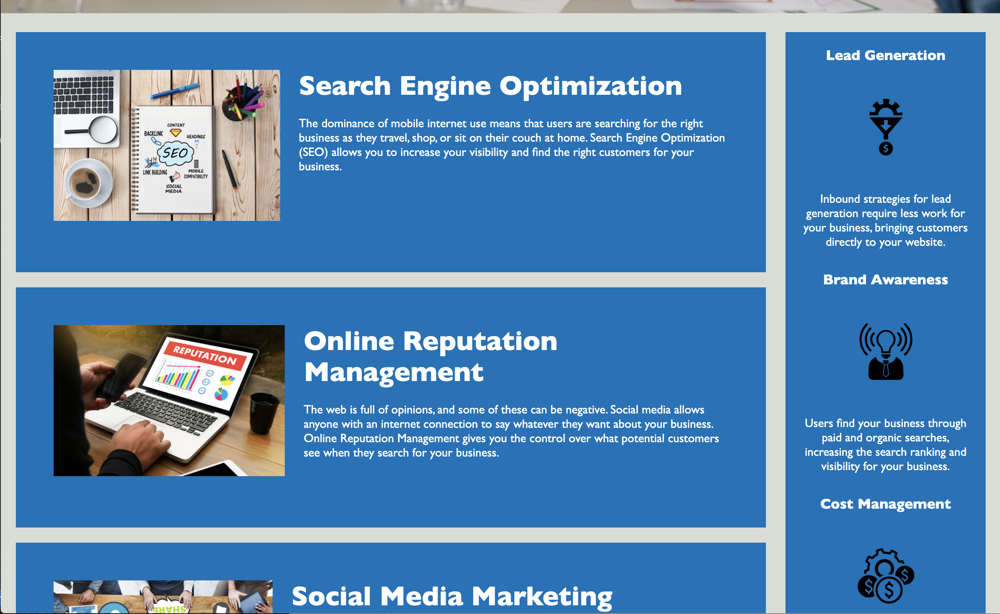
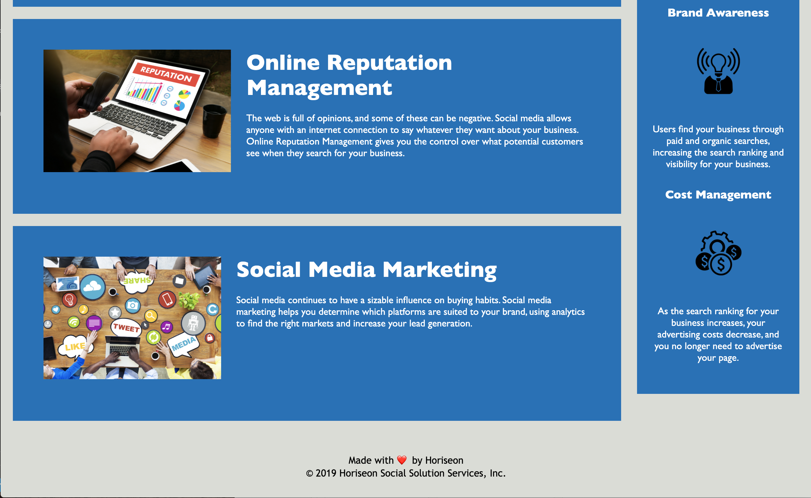

# horiseon-optimization

Horiseon website - accessibility standard optimization

## Table of contents

- [General info](#general-info)
- [Screenshots](#screenshots)
- [Technologies](#technologies)
- [Setup](#setup)
- [Features](#features)
- [Status](#status)
- [Inspiration](#inspiration-sources)
- [Contact](#contact)

## General info

The piurpose of this project is to clean up code syntax, condense css styles and optimize website fucionalitly and acessibilty standard

## Screenshots

## Technologies

- Tech 1 - html5
- Tech 2 - Css

## Features

List of features ready and TODOs for future development

- Anchor links in nav bar to other sections of the page.

To-do list:

- Add links to other pages in nav bar
- more style

## Status

Project is: _in progress_ other features can be added to make website more dynamic an dinteractive

## Inspiration-sources

study group 1 - We helped eachother slove issues by debugging, sharing outside resources and going step by step to understand why soemthing was written/coded the way it was.

w3schools

## Contact

Created by Mariah Rivera
